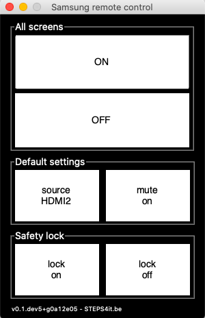

**********************
samsung_remote_control
**********************

Samsung remote control using the `Multiple Display Control <https://github.com/psmsmets/samsung_mdc>`_ protocol via TCP/IP

Features
========

Provides a simple gui to control all TV's at once.

 
Usage
=====

In the terminal execute

.. code-block:: console

    >>> samsung_remote_control --help

to show this help message and exit

.. code-block:: console

    usage: samsung_remote_control [-h] [--locale ..] [--source ..] [--timeout ..]
                                  [-v]
                                  host[:port] [host[:port] ...]

    Samsung remote control using the Multiple Display Control Protocol via TCP/IP

    positional arguments:
      host[:port]    Remote TV ipv4 addresses (default port: 1515)

    optional arguments:
      -h, --help     show this help message and exit
      --locale ..    Set locale (default: en). Allowed values are: en, nl, fr
      --source ..    Set source (default: HDMI2). Allowed values are: Input
                     source, DVI, MagicInfo, HDMI1, HDMI2, DisplayPort
      --timeout ..   Set a timeout on blocking socket operations, in seconds
                     (default: 5.0). Timeout > 0: raise timeout exception. Timeout
                     == 0: non-blocking mode. Timeout < 0: blocking mode.
      -v, --version  Print the version number and exit

Control remote TV's

.. code-block:: console

    >>> samsung_remote_control --locale=nl 192.168.2.201 192.168.2.202:1515

Windows executable
==================

Create a ``.bat`` to launch the remote control gui making use of `PowerShell`_, 
`Miniconda3`_ and the `samsung_mdc`_ Python3 package

.. _PowerShell: https://docs.microsoft.com/en-us/powershell/scripting/overview?view=powershell-7
.. _Miniconda3: https://docs.conda.io/en/latest/miniconda.html
.. _samsung_mdc: https://github.com/psmsmets/samsung_mdc

.. code-block::
 
    :: samsung_remote_control.bat

    @echo off

    set root=C:\ProgramData\Miniconda3

    set hosts=192.168.2.201 192.168.2.202 192.168.2.203^
        192.168.2.204 192.168.2.205 192.168.2.206^
        192.168.2.208 192.168.2.209 192.168.2.210^
        192.168.2.211 192.168.2.212

    call %root%\Scripts\activate.bat

    powershell -window hidden -command "samsung_remote_control %hosts% --locale=nl"

A custom icon can be set by creating a short-cut to this ``.bat`` file.

License information
===================

Licensed under the GNU GPLv3 License. See the ``LICENSE``- and ``NOTICE``-files
or the documentation for more information.
